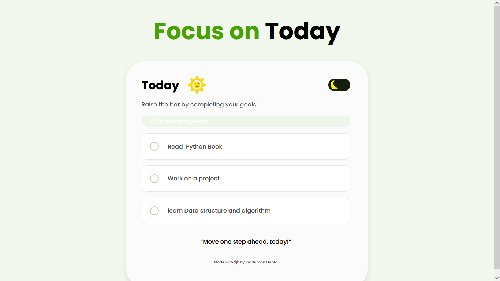
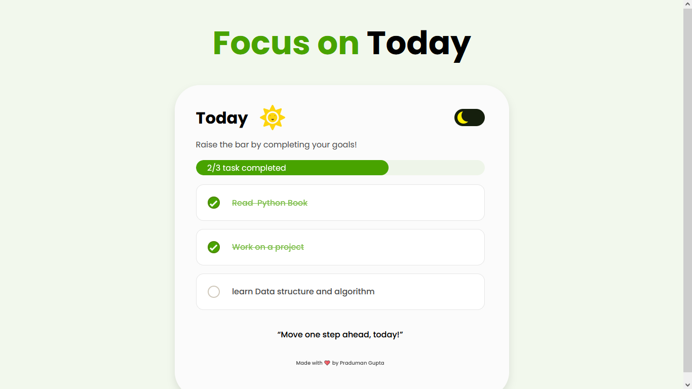
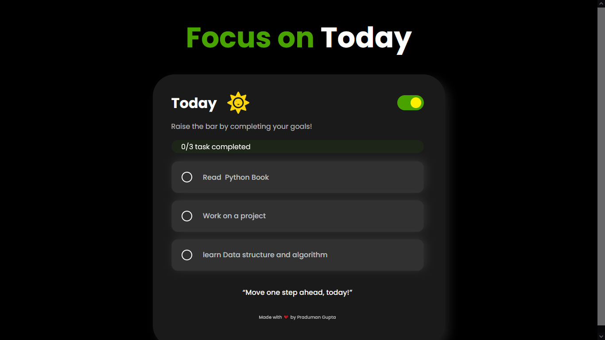

# 🧠 Focus on Today – Mini Productivity App

This is a self-built productivity mini-app that allows users to set 3 daily goals, mark them complete, and visualize progress through a progress bar. It helped me practice DOM manipulation, input validation, conditional UI logic, and `localStorage` persistence — all without copying from tutorials.

---

## 📑 Table of Contents

- [Overview](#overview)
  - [The Challenge](#the-challenge)
  - [Screenshot](#screenshot)
  - [Links](#links)
- [My Process](#my-process)
  - [Built With](#built-with)
  - [What I Learned](#what-i-learned)
  - [Continued Development](#continued-development)
- [Author](#author)

---

## 🧐 Overview

### ✅ The Challenge

Users should be able to:

- Enter 3 goal inputs for the day.
- Get error message if trying to check a task before entering all goals.
- See a dynamic progress bar update as tasks are completed.
- See a message like `1/3 tasks completed`, `2/3 tasks completed`, etc.
- Automatically save input and checkbox state in localStorage.
- Restore everything (inputs, checkboxes, progress) on page reload.

---

### 🖼️ Screenshot

---

### 🔗 Links

- GitHub Repo: [@yourusername](https://github.com/C-W-Praduman/Focus-on-Today)
- Live Demo: [focus-on-today.vercel.app](https://focus-on-today-snowy.vercel.app/)

---

## 🛠️ My Process

### 🔧 Built With

- **HTML5**
- **CSS3** (Flexbox, Variables)
- **JavaScript** (Vanilla)
- **Mobile-first** approach
- **localStorage** for saving state
- Clean and semantic class naming

---

### 📚 What I Learned

This project helped me understand:

- How to prevent default checkbox behavior until all inputs are filled.
- Use of `.every()`, `.filter()` and `forEach()` to manage DOM logic.
- Storing and retrieving complex data (arrays of values and booleans) in `localStorage`.
- Showing/hiding warning messages dynamically.
- Dynamically updating styles (like `width`) using JavaScript.
- Writing real-world JS logic step-by-step from scratch.

---

### 🔁 Continued Development

In future versions, I plan to:

- Add a reset button to clear all tasks.✔✔✔
- Add date-based task history.
- Include dark/light theme toggle.✔✔✔
- Animate progress transitions and warning messages.

---

### 👨‍💻 Author

- GitHub – [@yourusername](https://github.com/C-W-Praduman)
- Project built and completed with ❤️ by **Praduman Gupta**

---
